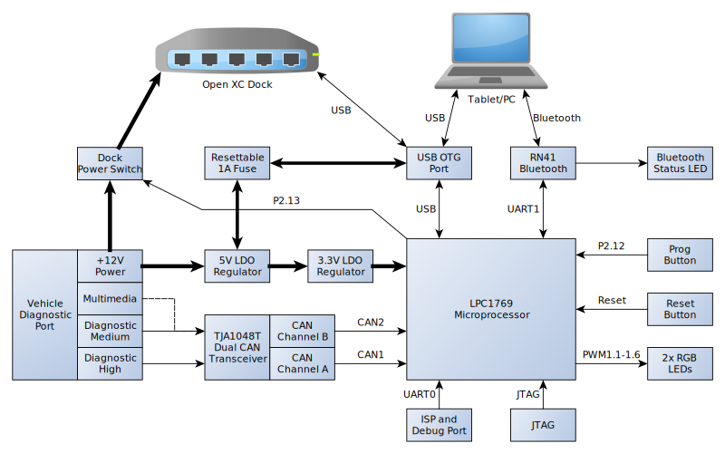
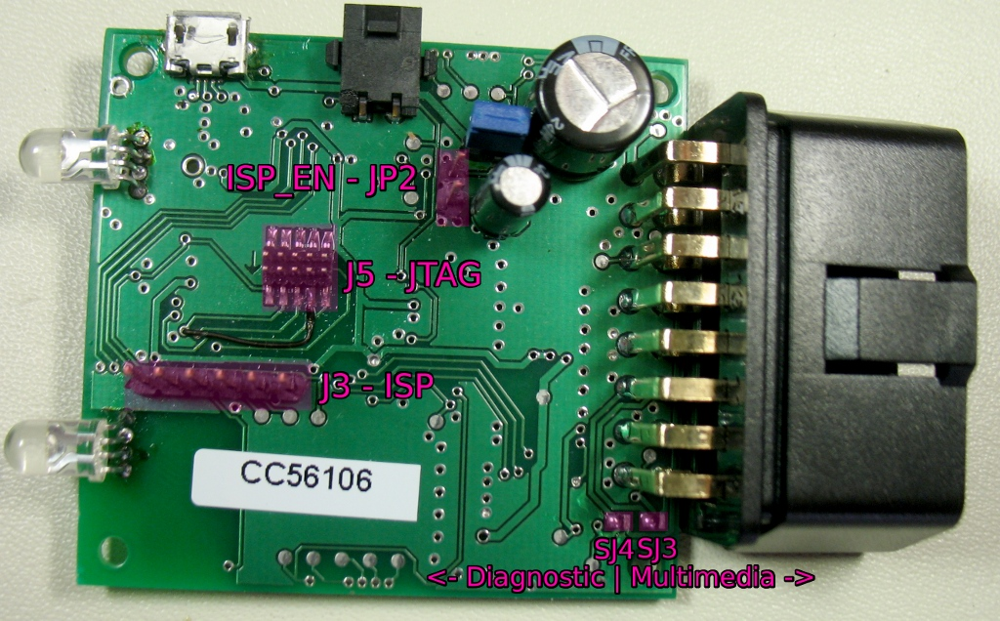

OpenXC Vehicle Interface
========================

[TOC]

Details
-------

### Block diagram



The Vehicle Interface is built around an LPC1769 ARM Cortex M3 MCU by NXP,
running at 100MHz.  The interface reads vehicle data via two CAN busses.  By
default the device reads from the Diagnostic High speed and Diagnostic Medium
speed busses (Channel B can also read from the Multimedia CAN bus).  The CAN
busses are converted into serial data by a [TJA1048
IC](http://www.nxp.com/documents/data_sheet/TJA1048.pdf).  The translated data
is sent to a tablet or PC via USB and Bluetooth.  USB is achieved by the device
controller built into the LPC1769.  Bluetooth is achieved via a [Roving Networks
RN-41 Embedded bluetooth module](http://www.rovingnetworks.com/products/RN41),
using UART channel 1 on the LPC1769 with hardware flow control.

The Dock has two power regulators.  The main regulator is a low dropout linear
regulator regulator that steps the +12V automotive power down to a steady +5V.
A smaller 3.3V low dropout regulator (LDO) provides the USB Hub with a 3.3V
rail.  The power section is configured so that a USB OTG host can either provide
or consume +5V power.  If the Dock is plugged into a PC or laptop, the +5V power
can be used to power the Dock and downstream devices.  If a mobile phone or
tablet is plugged into the Dock, and is configured to charge from the USB OTG
port, it will be able to charge from the +5V power.  This is protected by a 1A
PTC resettable fuse - if a power fault occurs, the fuse will trip and power will
need to be removed for several minutes until the fuse is reset.

Several other headers and jumpers have been exposed for development purposes.  A
header has been provided to access UART0 on the LPC1769 - this can be used for
serial debug as well as ISP programming.  The standard JTAG interface has also
been exposed through a 10-pin ARM JTAG Mini connector.  Two buttons have also
been added to the board - one resets the LPC1769, and the other allows the
LPC1769 to enter a USB bootloader if available.  See
[Inputs/Outputs](#inputsoutputs) for more information.

### Parts Layout





### Inputs/Outputs

#### Buttons

* S1 (RESET) - Pressing this button will reset the LPC1769 (it will not reset
  the RN-41 chipset)
* S2 (PROG) - This button engages a USB Bootloader. Hold down S2 while pressing
  S1 to enter the bootloader.

#### Headers and jumpers

* JP1 (HOST PWR) - Shorting this jumper will allow the board to either charge an
  upstream USB device, or be powered by it.
* JP2 (ISP_EN) - Shorting this jumper will place the LPC1769 in ISP Bootloader
  mode when it is reset. In ISP Bootloader mode, user code is not run - J3 can
  only be used to deploy firmware over serial.
* J3 (ISP) - The debug serial port (UART0) which can also be used for ISP
  programming (see JP2).
* J5 (JTAG) - This is a 50 mil pitch 10-pin ARM Mini JTAG interface. An adapter
  can be used to connect the standard 100 mil 20-pin JTAG connector.

#### Solder Jumpers

* SJ1, SJ2 - These are used to engage the 120 ohm termination resistor for CAN
  interfaces A and B respectively. If being used in a test bench without a full
  CAN network, you probably want these enabled. It may be simpler and more
  reversible to add the resistors to the OBD-II cable, instead.
* SJ3, SJ4 - These switch the CAN B channel between the Diagnostic Medium Speed
  and Multimedia CAN Busses exposed by the OBD-II connector on Ford vehicles.
  They are each shorted towards the PCB edge, enabling the Diagnostic interface
  by default.
* SJ5  - This connects the DTR line of the ISP header (J3) to the LPC1769 RESET
  line. This can be used by an ISP programmer to automatically reset the LPC1769
  for programming.  In practice, this can accidentally hold the LPC1769 in
  reset, so this jumper should be OPENED if J3 is used.
* SJ6  - This disconnects the RN-41 reset pin from the BT_RST GPIO pin on the
  LPC1769. This is normally closed, and should only be opened if the RN-41 needs
  to be put into reset without the LPC1769.

### GPIO Pin List

A list of GPIO pins used on the LPC1769

#### Port 0

* P0.2 - ISP/Debug UART: TX
* P0.3 - ISP/Debug UART: RX
* P0.4 - CAN Channel B: RX
* P0.5 - CAN Channel B: TX
* P0.6 - CAN Channel B: Enable (HIGH = Normal Mode, LOW = Standby Mode)
* P0.15 - Bluetooth UART: RX
* P0.16 - Bluetooth UART: TX
* P0.17 - Bluetooth Enable: (HIGH = RN-41 is enabled, LOW = RN-41 is in RESET)
* P0.18 - Bluetooth Connection: INPUT - Will go high when bluetooth host is
  connected
* P0.19 - CAN Channel A: Enable (HIGH = Normal Mode, LOW = Standby Mode)
* P0.21 - CAN Channel A: RX
* P0.22 - CAN Channel A: TX
* P0.29 - USB D+
* P0.30 - USB D-

#### Port 1

* P1.18 - LED4 (Right LED) Green Channel
* P1.20 - LED4 (Right LED) Blue Channel
* P1.21 - LED4 (Right LED) Red Channel
* P1.23 - LED1 (Left LED) Green Channel
* P1.24 - LED1 (Left LED) Blue Channel
* P1.26 - LED1 (Left LED) Red Channel
* P1.30 - USB VBUS: Connected to USB +5V pin

#### Port 2

* P2.2 - Bluetooth UART: RTS (LOW when RN-41 is ready for data, HIGH when RN-41
  serial buffer is full)
* P2.7 - Bluetooth UART: CTS (LOW when LPC1769 is ready for data, HIGH when
  LPC1769 serial buffer is full)
* P2.9 - USB CONNECT: Enables USB Pullup (LOW when USB unused, HIGH to signal
  USB interface is ready)
* P2.10 - ISP ENABLE: When HIGH, User code runs on next RESET. When LOW, ISP
  Serial bootloader runs on next RESET.
* P2.12 - USB Bootloader ENABLE: When HIGH, User code runs on next RESET. When
  LOW, USB bootloader runs on next RESET
* P2.13 - Power output enable (Active Low): Output power port enabled when LOW

Usage:
------

### How to program

The most reliable way to program the vehicle interface is via the JTAG
interface, however other options are available:

#### JTAG

To program using JTAG, any ARM Cortex M3 compatible JTAG adapter can be used.
The interface has been tested using an
[ARM-USB-TINY-H](https://www.olimex.com/Products/ARM/JTAG/ARM-USB-TINY-H/) and
an [ARM-USB-OCD-H](https://www.olimex.com/Products/ARM/JTAG/ARM-USB-OCD-H/) by
Olimex.  The interface board does not have a full-size 20-pin JTAG connector -
[an adapter will be required with most JTAG
programmers](https://www.olimex.com/Products/ARM/JTAG/ARM-JTAG-20-10/).  Simply
plug the ARM-JTAG-MINI connector into J5 on the bottom side of the vehicle
interface PCB.  Make sure that the ribbon cable exits the connector in the
direction of the arrow on the PCB.

With the JTAG adapter connected, and power applied to the board, the LPC1769
should respond to commands from [OpenOCD](http://openocd.sourceforge.net/).  If
deploying code from an OpenXC repository, the board can be programmed by simply
executing "make flash" from the root of the source tree.  See other LPC17XX JTAG
tutorials for more information, the process is nearly identical across all
LPC17XX devices.

#### ISP

If a [3.3V USB-Serial converter is
available](https://www.sparkfun.com/products/9873), the device can be programmed
using the ISP header, J3.  To use ISP simply short JP2 and reset the LPC1769.
If the ISP_EN pin is grounded when the LPC1769 boots, it will enter the built-in
ISP bootloader instead of running the OpenXC firmware.  UART0 will then be used
for programming under an application like [Flash
Magic](http://www.flashmagictool.com/).  Page 616 of the LPC17XX user manual
outlines how to use ISP mode.

#### USB Bootloader

The LPC1769 has the capability to load code from the USB interface, however this
is not built into the MCU.  In order to program over USB, a USB bootloader must
already have been programmed onto the LPC1769.  The USB Bootloader should watch
pin P2.12 (the same pin as the LPC1768 BlueBoard) on startup.  If installed
correctly, the bootloader can be actived by holding down S2 while resetting the
vehicle interface.

#### RN-41 Configuration

After being manufactured, the only additional configuration step (outside of
deploying firmware) is to change a few default values on the RN-41 device.  The
default RN-41 baud rate is 115200 baud, which is not high enough to saturate the
bluetooth link.  The quickest way to preform this first initial configuration is
to use a PC or tablet with a bluetooth interface:

1. Apply power to the vehicle interface.
1. Discover Bluetooth devices on the PC, find the vehicle interface, and pair
      with it.
1. Remove power from the vehicle interface.
1. After a few moments, reapply power to the vehicle interface
1. Very quickly (within 60 seconds) connect to the vehicle interface and open a
    terminal
1. type "$$$" and press enter.  If done quickly, the bluetooth LED should
      start flashing rapidly and "CMD" should be printed to the screen.
1. type "ST,10" to reduce the configuration timer to 10 seconds.  It can also
      be disabled by executing "ST,0".
1. type "SU,43" to set the baud rate to 460800.  This value is used by the test
    firmware.
1. type "---" to exit configuration mode
1. Remove power from the vehicle interface.  When power is reapplied, the
   settings will be changed.

The commands can also be sent via UART0 on the LPC1769 to avoid the
configuration timer.  See [the RN-41 advanced user
manual](http://www.rovingnetworks.com/resources/download/47/Advanced_User_Manual)
for additional documentation on parameters that can be changed (Page 30 for a
quick reference)


### Known issues:

For greater detail, see [the CAN Translator Changelog](./CAN Translator Changelog + Testing.xls)

#### R0.3:

* The very first run of prototypes are lacking epoxy on the USB Micro connector
  and the connector may break under stress.  This will be fixed in subsequent
  manufacturing runs.

#### R0.2:

* Output Power Jack Polarity is incorrect - The output power jack should be
  configured such that Pin 1 (the keyed pin) is Ground, and Pin 2 is +12V. This
  is flipped on the R0.2 PCB. A custom cable was created to patch this issue,
  and is labeled `R0.2 Only`. Only use this cable with R0.2 prototypes,
  otherwise the KBoard TVS Diode D2 and/or the CAN Translator power switch IC7
  may be damaged or destroyed.
* JTAG CLK line - the JTAG signal RTCK was disconnected on R0.2 boards. It has
  manually been replaced with a wire. Occasionally the additional capacitance of
  this wire can cause JTAG errors - try reducing the JTAG clock rate.
* JTAG Ground noise - Occasionally JTAG errors can be caused by a ground loop
  between a USB JTAG adapter and the MicroUSB port on the CAN Translator. Try
  removing one or more connections to ground: IE, try powering the prototype
  from ONLY +5V USB verses the +12V OBD-II supply.
* Bluetooth connection dropout - Under some circumstances, the RN-41 bluetooth
  chipset will lock up and drop an active bluetooth connetion when under heavy
  load:
    * The most common cause of this problem is software flow control: make sure
      to use the RTS and CTS pins for UART1.
    * The RN-41 configuration timer can also cause the RN-41 input buffer to
      fill. From the LPC1769, enter configuration mode by transmitting
      ```$$$```, disable the configuration timer with ```ST,0\r\n``` and then
      exit configuration mode by entering ```---\r\n```. Finally, power cycle
      the CAN Translator. The test firmware `rn42-passthrough` enables serial
      data to be relayed between UART0 (the 6-pin ISP header) and UART1 (the
      bluetooth interface).

Design details:
---------------

### MCU Selection

The Vehicle Interface was originally built around a ChipKit MAX32 development
board, which used a PIC32MX795F512 processor.  We chose to move away from this
architecture due to frustrations around the open-source support and tools of the
PIC32 line.  We had trouble developing for this platform in Linux, and had to
resort to closed-source windows tools in order to use the device effectively.
Most other MCUs in the same performance category as the PIC32 device lie in the
[ARM-Cortex-M family](http://en.wikipedia.org/wiki/ARM_Cortex-M), particularly
the ARM Cortex-M3 core.  Several major MCU manufacturers make Cortex-M3 devices
(Atmel, NXP, STMicro, TI),  The NXP LPC17XX line was selected due to it's
excellent open-source compiler support, library support, and ease of
programming.  Many off-the-shelf open-source hardware designs exist for the
LPC1768, and this encourages a large amount of community support and a wider
variety of user-contributed libraries.

The MCU system design was based around the [Blueboard
LPC1768-H](http://shop.ngxtechnologies.com/product_info.php?products_id=65).
This was done to allow firmware to be prototyped on an off-the-shelf open-source
hardware.  The hardware configuration is also compatible with the [MBED rapid
prototyping board/environment](http://mbed.org/).  The Clock, Power and USB
subsystems are all equivalent.  The JTAG interface was converted to the 10-pin
ARM JTAG Mini format to reduce the PCB footprint of the normal large 20-pin JTAG
connector.  This results in a 12MHz external crystal oscillator stepped up to a
100MHz system clock.

### LPC1769 Data

* [LPC1769FB100 Product Page](http://www.nxp.com/products/microcontrollers/cortex_m3/LPC1769FBD100.html)
* [LPC176X Datasheet](http://www.nxp.com/documents/data_sheet/LPC1769_68_67_66_65_64_63.pdf)
* [LPC17XX User Manual](http://www.nxp.com/documents/user_manual/UM10360.pdf)
* [Blueboard LPC1768-H Product Page](http://shop.ngxtechnologies.com/product_info.php?products_id=65)
* [Blueboard LPC1768-H Schematics V2](http://shop.ngxtechnologies.com/download/Schematics/BlueBoard/BB_LPC1768_H/Blueboard_lpc1768_H_V2.pdf)
* [mbed LPC1768 schematics](http://mbed.org/media/uploads/chris/mbed-005.1.pdf)

### Power Section

The Vehicle interface uses two heavy-duty low dropout linear regulators to
convert the unpredictable +12V automotive power source to the +5V and +3.3V
rails needed by the MCU and related ICs.  Incoming power is protected from
overvoltage by D3, a [SMBJ16CA](http://www.fairchildsemi.com/ds/SM/SMBJ16CA.pdf)
Transient Voltage Suppressor (TVS) diode.  D3 will protect the interface from
any voltage over 19.7V (Vbr).  The power regulators can handle up to 40V, but
the Dock power switch (IC7) can only tolerate up to 20V.  Reverse voltage is
protected by D1.  Both regulators do not require any additional current or
temperature protection - they can safely drive into a short circuit at
temperatures up to 150 degrees C, and will limit current if they become too hot.
Plenty of bulk and bypass capacitance has been provided to absorb automotive
power transients.

The regulators are cascaded such that the +5V rail supplies the +3.3V rail.  The
TLE4284DV33 has a maximum voltage drop of 1.4V, so it can be safely powered by
any source above 4.7V.  While this puts additional load on the +5V rail, it also
allows the interface to be powered either by the OBD-II connector or the
MicroUSB port.  Both regulators can deliver current up to 1.6A.  Current budget:

* 5V regulator capacity: 1600mA
* USB Charging Limit (fuse): 1000mA
* RN-41 average TX rate: 60mA
* LPC1769 Base consumption @ 100MHz: 50mA
* LPC1769 peripherals (2xCAN+2xUART): 3mA
* Both RGB LEDs on at full: 60mA
* TJA1048T both channels dominant: 140mA
* Total: 1313mA

This yields a headroom of ~300mA when all peripherals are active and a Tablet is
charging at 1A.

### Power Input/Output

The Vehicle Interface has the following power connections:

* OBD-II Automotive Power: Input @ 12V
* Dock Power Connector: Output @ 5V up to 6A
* USB Micro Connector: Input OR Output @5V up to 1A

The Dock power connector is controlled by a [TPS2421-2 power switch with
internal MOSFET](http://www.ti.com/lit/ds/symlink/tps2421-2.pdf).  This allows
the Dock power to be disabled when the vehicle is turned off, as well as
providing current protection.  The power switch has an active 6A limit, and will
actively attempt to re-engage power when the limit is tripped ("retry on
fault").

The USB Micro Connector is directly connected to the +5V bus through a Fuse.
The lack of a diode means that the connected USB device can either consume or
supply current.  If a PC is connected to the USB Micro connector, it will power
the 3.3V regulator and the +5V regulator will be bypassed.  If an android tablet
is connected that supports USB OTG Charging, it will be allowed to consume +5V
power.  A resettable fuse (F1) has been added to protect the vehicle interface
from a bad USB cable or USB Host.  The fuse is a [Bourns
MF-MSMF110/16-2](http://www.bourns.com/pdfs/mfmsmf.pdf).  The fuse will
automatically reset when power is removed and the fuse is allowed to cool off.
This has an added downside of temperature dependence - the fuse can only pass
the full 1A of current up to 40 degrees C.  Above that temperature the limit
slowly decreases - see the datasheet for a thermal derating chart.

### CAN Interface

The CAN interface is acheived using an [NXP
TJA1048](http://www.nxp.com/documents/data_sheet/TJA1048.pdf), a dual-channel
CAN transceiver.  This is a part recommended by Ford engineers for it's
reliablity and robustness.  The only hard requirement of this transceiver is
that it have a Standby mode, and some way to wake up the microcontroller when
the CAN bus comes out of standby.  Aside from the CAN signals, the TJA1048 also
has one standby input per channel - pulling each line low will put it's
respective CAN channel into standby mode.  These are routed to P0.19 for CAN
Channel 1, and P0.6 for CAN Channel 2.

On the automotive side of the CAN transceivers, some support electronics are
required.  D4 and D5 provide additional ESD protection against voltage spikes on
the CAN line - each
[PESD1CAN](http://www.nxp.com/documents/data_sheet/PESD1CAN.pdf) can provide up
to 200W of peak dissipation and ESD protection up to 23kV.  R1 and R2 provide
termination resistance for the CAN Bus.  If the CAN Translator is acting as a
CAN Slave, and is reading CAN signals from a vehicle, these resistors need to be
connected across the HI and LO wires of each CAN bus.  SJ1 and SJ2 are closed by
default, enabling this termination.  If this termination is not needed, the
solder jumpers can be cut.  Finally, each CAN signal as a 100pF bypass capacitor
very close to the OBD connector, to shunt high frequency noise to ground.

The CAN bus doesn't particularly require a high speed PCB design, since the rate
is only 1Mbps at most.  However an attempt was made to maintain the
characteristic 120 ohm differential impedance on the CAN lines.  An attempt was
also made to maintain a 45 mil guard band around each CAN bus, to keep high
frequency switching transients from coupling onto the CAN bus.  The guard band
was also applied to the LPC1769 side of the CAN transciever, to keep the same
transients out of the converted CAN signals.  Since the layout is only 2 layers
and very crowded, this wasn't implemented perfectly, but seems to be within 85%
coverage.  The combination of these considerations means that the CAN interface
should be highly resilient to noise and should limit signal distortion due to
reflections and other transmission line phenomenon.

### Bluetooth Interface

The [Roving Networks RN-41](http://www.rovingnetworks.com/products/RN41) was
chosen to implement the Bluetooth interface for the vehicle interface:

* a low-cost and easy-to-use option
* easily prototyped
* automatically implents the Serial Port Profile (SPP) configuration
* no need to implement a Host/Controller Interface (HCI), keeps MCU code simple

The only major design impact of the RN-41 is that it requires a large "keepout"
area near the antenna of the module.  In this area, there should be a minimal
amount of traces or copper blocking the radio signal.  The [RN-41
Datasheet](http://www.rovingnetworks.com/resources/download/18/RN_41)
illustrates the suggested keepout zone on page 9.  Otherwise, the RN-41 is
controlled with a serial UART bus with similar bitrates to the CAN data (230kbps
- 1Mbps).  In our testing we discovered that hardware flow control is necessary
to fully saturate the bluetooth link.  The firmware on the RN-41 does not
respond well to buffer overruns - if data is written to the RN-41 faster than it
can be sent over the bluetooth link, the module will eventually overflow and
reset without warning.  Adding the RTS and CTS lines to UART1 on the LPC1769
fixed this problem - the RN-41 will inform the MCU host when it's buffer is
full.

The tradeoff of a simplified Bluetooth module is that the implementation details
of the SPP profile limit the throughput of the bluetooth link.  While the
underlying Enhanced Data Rate (EDR) bluetooth link can technically operate at
3Mbps, the asynchronous nature of SPP limits the RN-41 to 240kbps in slave mode.
In our testing, the RN-41 only hit this speed for brief peak bursts.  The
sustained average speed was 202kbps.  Future designs may consider using a more
complicated bluetooth chipset with an HCI interface implemented on the MCU for
greater throughput.  An example of a test run:


<!---->

* Average rate: 25.282 KB/s
* Maximum speed: 30.185 KB/s
* Minimum speed: 14.718 KB/s

### USB Interface

USB is provided directly by the LPC1769 - no external transceiver or controller
is necessary.  A few external components are required to correctly enable the
LPC1769 as a USB Device and can be found on [Page 276 of the LPC1769
manual](http://www.rovingnetworks.com/resources/download/47/Advanced_User_Manual).
The USB_CONNECT line and associated circuitry was mirrored from the LPC1768-H
Blueboard design so that USB bootloader firmware would be interoperable, and a
few modifications were made for additional resilience and device compatibility:

Diodes D2, D6 and D7 were added to ESD protect the USB lines.  D2 is an [NXP
PESD12VS1ULD](http://www.nxp.com/documents/data_sheet/PESD12VS1ULD.pdf)
unidirectional ESD protection diode.  D6 and D7 are [NXP
PESD5V0X1BL](http://www.nxp.com/documents/data_sheet/PESD5V0X1BL.pdf)
bidirectional ESD diodes.  All protection diodes are specifically designed for
the USB bus and have very low capacitance to avoid disrupting USB signals.

Resistor R25 attempts to indicate to an attached USB OTG device that the CAN
Translator can provide charging current.  A specification exists on [Page 48 of
the USB Battery Charging Specification
R1.2](http://kinetis.pl/sites/default/files/BC1.2_FINAL.pdf) describing an
Accessory Charger Adapter.  This specification defines special resistance values
on pin 4 of a USB OTG connector that should flag that the connected device is a
charging device.  However in practice very few devices actually honor this
specification.  It's totally up to the implementation of the portable tablet or
smartphone whether or not they support charging while using the USB port as a
USB Host.

If a Male-Male USB Micro cable is used with the vehicle interface, this
identification resistor will be readable by a connected USB OTG device.  If the
device is USB ACA compliant, it will successfully charge.  If a Male-Male cable
is unavailable, or if the device doesn't honor the USB ACA specification, a
normal USB A to USB Micro cable can be used with a commonly-available USB OTG
Host mode adapter.  For example:

* A Samsung Galaxy Note II with stock android firmware will honor the USB ACA
  profile [(from this forum post)](http://www.head-fi.org/t/595071/android-phones-and-usb-dacs/405#post_8748466)
* A Motorola Droid Razr with stock firmware and a normal USB OTG Host cable will
  charge (tested)
* A Google Nexus 7 tablet will not charge from the USB OTG port when host mode
  is enabled without a custom firmware (tested)

USB signals require high speed PCB routing to avoid signal integrity issues,
since the bitrates are high (11Mbps - 480Mbps).  Unfortunately with a 2 layer
PCB, the trace widths required to obtain the ideal 90 ohm differential impedance
for a USB line would be unfeasibly wide.  To compensate for this fact, the USB
connector was located extremely close (~300 mils) to the LPC1769 USB pins.  A
guard band was used around the USB lines and tightly coupled to the ground
plane.  The ground plane underneath the USB signals was kept clear so the ground
loop would be kept small and transient ground currents would avoid coupling into
the USB signal.
